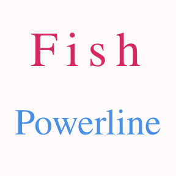

#### fish-powerline
> [powerline-shell](http://blog.fpliu.com/it/software/powerline-shell) wrapper for [Oh My Fish][omf-link].

[](/LICENSE)
[](https://fishshell.com)
[](https://www.github.com/oh-my-fish/oh-my-fish)

<br/>


## Install
1、use [pip](http://blog.fpliu.com/it/software/pip) to install [powerline-shell](http://blog.fpliu.com/it/software/powerline-shell):
```fish
$ pip install powerline-shell
```
2、use [omf](http://blog.fpliu.com/it/software/oh-my-fish#omf) to install this theme:
```fish
$ omf install powerline
```

## Screenshot

<br/><br/>
<br/><br/>
<br/><br/>


# License

[MIT][mit] © [leleliu008][author] et [al][contributors]


[mit]:            https://opensource.org/licenses/MIT
[author]:         https://github.com/leleliu008
[contributors]:   https://github.com/leleliu008/fish-powerline/graphs/contributors
[omf-link]:       https://www.github.com/oh-my-fish/oh-my-fish

[license-badge]:  https://img.shields.io/badge/license-MIT-007EC7.svg?style=flat-square
